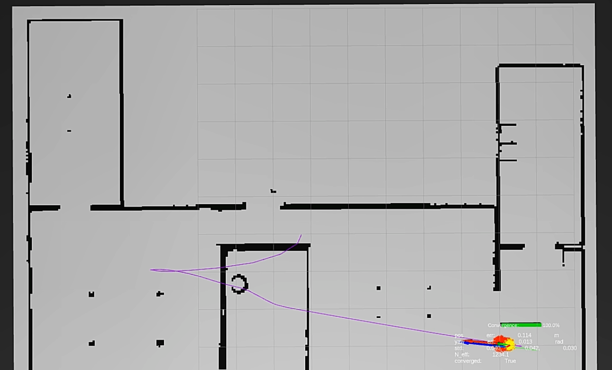
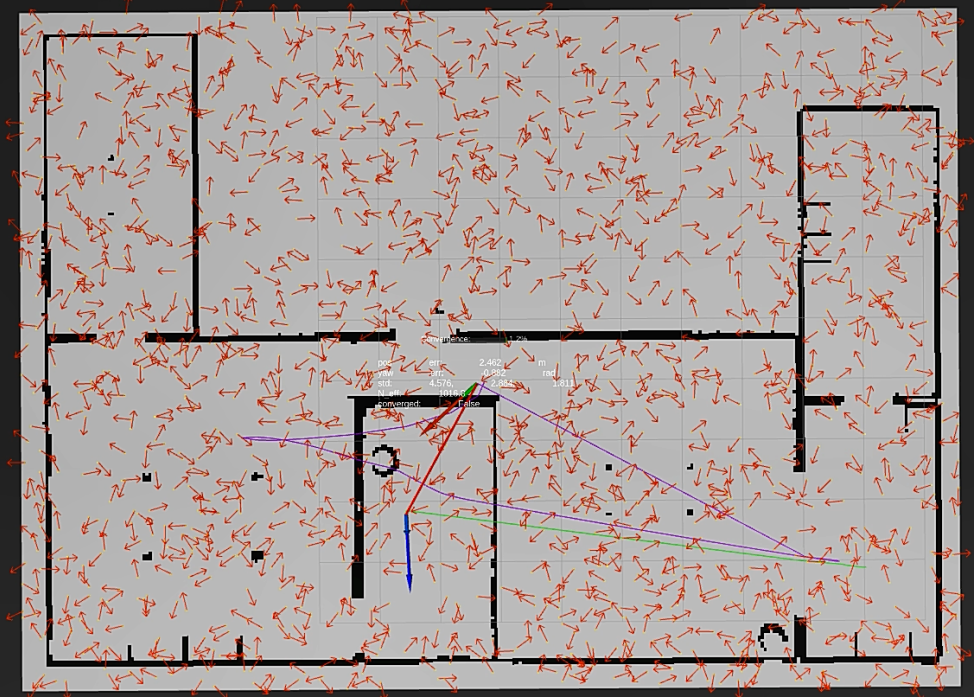
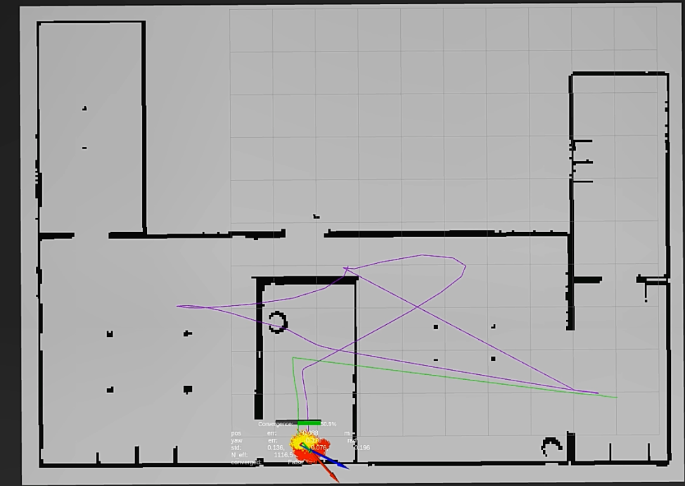
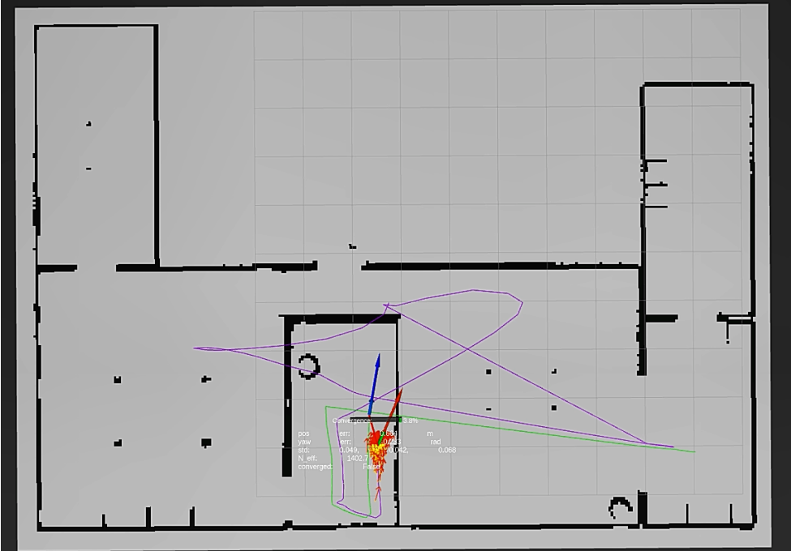
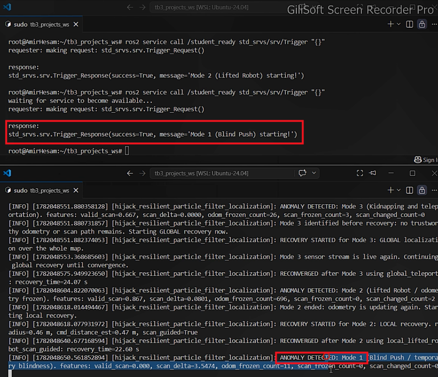
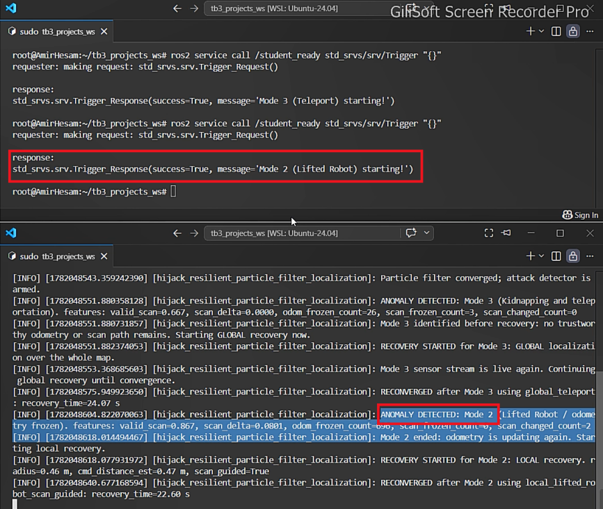
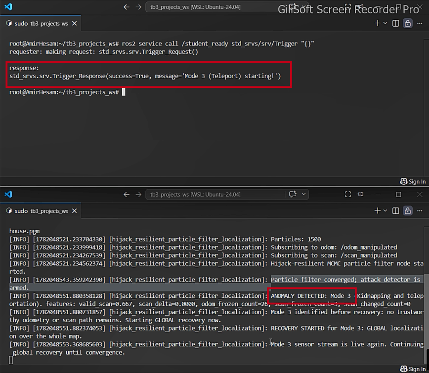
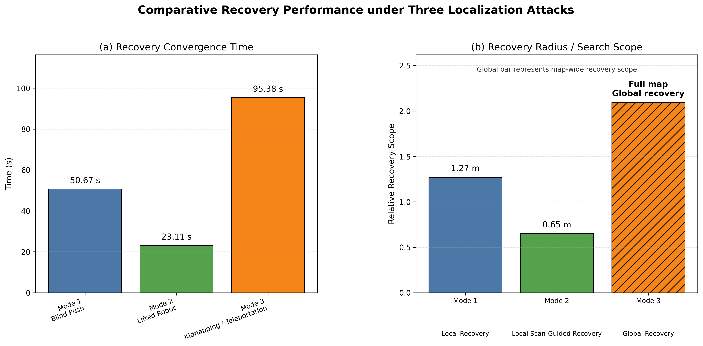

# Hijack-Resilient Monte Carlo Localization for TurtleBot3

<p align="center">
  <strong>Attack-aware LiDAR localization with particle filtering, MCMC refinement, and adaptive recovery</strong>
</p>

<p align="center">
  
  
  
  
</p>

**Hijack-Resilient Monte Carlo Localization** is a ROS 2 research project that enables a simulated TurtleBot3 to **detect localization attacks and recover its position** using only its manipulated LiDAR/odometry streams and commanded motion. The localization backbone is a **Monte Carlo particle filter** with a likelihood-field sensor model and a **Metropolis–Hastings (MCMC) resample–move step**. An attack-aware state machine selects **local** or **global relocalization** according to the detected failure mode.

<p align="center">
  
  <br /><em>Example RViz view: occupancy map, LiDAR observations, robot estimate, and localization visualization.</em>
</p>

> [!IMPORTANT]
> **Repository scope.** This archive contains the implemented `lidar_analysis_py` ROS 2 package, but **not** the house map, TurtleBot3 simulation packages, explorer launch package, or hijacking simulator/referee. Full end-to-end reproduction requires those external course/simulation components. See [Prerequisites](#prerequisites) and [Known limitations](#known-limitations).

## Contents

- [Highlights](#highlights)
- [Attack scenarios and recovery](#attack-scenarios-and-recovery)
- [Results and visualizations](#results-and-visualizations)
- [Repository layout](#repository-layout)
- [Prerequisites](#prerequisites)
- [Installation](#installation)
- [Running the experiment](#running-the-experiment)
- [ROS interfaces](#ros-interfaces)
- [Configuration](#configuration)
- [Logging and evaluation](#logging-and-evaluation)
- [Implementation notes](#implementation-notes)
- [Known limitations](#known-limitations)
- [References](#references)

## Highlights

- **Global localization:** initializes a configurable population of particles over collision-free map cells.
- **Probabilistic state estimation:** combines noisy odometry with subsampled LiDAR measurements against a precomputed occupancy-map likelihood field.
- **MCMC-enhanced particle filtering:** applies Metropolis–Hastings proposals after low-effective-sample-size resampling to explore nearby plausible poses.
- **Sensor-consistency attack detection:** distinguishes blindness, odometry freeze with live scans, and simultaneous sensor freeze using temporal scan/odometry/command features.
- **Adaptive recovery:** performs radius-limited, potentially scan-guided search after local disturbances, and map-wide reinitialization after teleportation.
- **Experiment observability:** publishes particle poses, estimated/ground-truth paths, convergence state, filter statistics, and time-series CSV logs.
- **Autonomous exploration helper:** publishes safe-ish wandering commands with front-obstacle avoidance to stimulate localization (not a full navigation stack).

The filter estimates planar robot pose **(x, y, yaw)**. Its core update sequence is:

1. **Predict:** calculate the rotation–translation–rotation increment from consecutive odometry messages and perturb it using motion-dependent Gaussian noise.
2. **Observe:** project a selection of LiDAR beam endpoints into the map and evaluate their distances to nearby occupied/unknown cells.
3. **Weight:** combine prior particle weights with scan log-likelihoods using numerically stable normalization.
4. **Resample and refine:** when effective sample size falls below a configured threshold, perform systematic resampling followed by MCMC proposals (if enabled).
5. **Estimate and evaluate:** compute the weighted position, circular mean yaw, particle spread, and convergence status. The separate detector can interrupt or reset these updates during an attack.

## Attack scenarios and recovery

| Mode | Disturbance | Evidence used by the detector | Recovery strategy |
|:--|:--|:--|:--|
| **1 — Blind push** | LiDAR returns become invalid while the robot may continue to move. | Very low fraction of finite, valid laser ranges. | Suspend unusable scan updates. When valid scans return, redistribute particles within a **local radius** around the last estimate, expanded by estimated commanded travel. |
| **2 — Lifted robot** | Odometry appears frozen while LiDAR continues to change. | Repeatedly negligible odometry change together with a changing LiDAR signature. | Once odometry resumes, draw collision-free candidates in a **local search area** and favor scan-consistent candidates. |
| **3 — Kidnapping / teleportation** | The robot may reappear at a distant, unknown pose. | Frozen odometry **and** scan signature despite expected motion. | **Immediately reinitialize particles globally** over free map space; resume normal correction once the scan stream becomes live. |

**Detection is armed after initial convergence by default** (`detection_requires_initial_convergence=true`). The classifier does **not** subscribe to the simulator's referee mode or unmanipulated `/scan` and `/odom` topics. Raw ground-truth odometry, if available, is used separately for monitoring/calibration and can affect the *convergence check*; see [Implementation notes](#implementation-notes).

### Relocalization in RViz

| Global recovery: hypotheses across the map | Local recovery: hypotheses around the estimated region |
|:--:|:--:|
|  |  |

Additional example after particle concentration and scan-based refinement:

<p align="center"></p>

### Attack-detection logs

The screenshots below show **simulator/referee output and the separate localization detector's terminal messages**. Some terminal captures include events from more than one attack test.

<details>
<summary><strong>Mode 1/2 — detection and local recovery messages</strong></summary>



</details>

<details>
<summary><strong>Mode 2/3 — detector decisions and recovery transitions</strong></summary>



</details>

<details>
<summary><strong>Mode 3 — teleportation detected and global recovery started</strong></summary>



</details>

## Results and visualizations

### Recovery comparison (supplied figure)

<p align="center"></p>

The separately supplied comparison figure contains the following **example-run measurements**:

| Attack | Recovery time | Local search radius / global search scope |
|:--|--:|:--|
| Mode 1 — Blind push | **50.67 s** | **1.27 m** |
| Mode 2 — Lifted robot | **23.11 s** | **0.65 m** |
| Mode 3 — Teleportation | **95.38 s** | **Entire map** |

## Repository layout

```text
.
├── README.md                  # This document
├── README.txt                 # Original workspace/run notes
├── report.pdf                 # Academic report (Persian)
├── assets/                    # Supplied figures and screenshots
└── lidar_analysis/            # ROS 2 package directory (package name: lidar_analysis_py)
    ├── package.xml
    ├── setup.py
    ├── setup.cfg
    ├── resource/
    ├── test/
    └── lidar_analysis_py/
        ├── hijack_resilient_particle_filter_node.py  # Main attack-aware MCMC PF
        ├── pf_explore_motion_node.py                  # Exploration controller
        ├── calibrate_truth_transform.py               # World-to-map truth alignment
        ├── lidar_noise_node.py                        # Synthetic LiDAR noise experiment
        ├── lidar_subscriber.py                        # LiDAR sampling/statistics
        ├── velocity_motion_node.py                    # Simple velocity test
        └── pf/
            ├── map_utils.py            # Map loading, free-cell sampling, distances
            ├── motion_model.py         # Odometry prediction model
            ├── observation_model.py    # LiDAR likelihood field
            ├── resampling.py           # Weight normalization / systematic resampling
            └── metrics.py              # Mean, spread, pose errors
```

Generated `__pycache__` files may also be present in the supplied package but are not required for a fresh build.

## Prerequisites

- **ROS 2** with `rclpy`, message packages, `tf2_ros`, RViz2, `colcon`, and `rosdep` available. Match the ROS 2 distribution to your operating system and simulation setup; the archive does not pin a distribution.
- **TurtleBot3 + Gazebo simulation** and the **`turtlebot3_explorer`** package exposing `turtlebot3_house_random_spawn.launch.py`.
- **Course-specific attack simulator and referee**, exposing `ros2 run hijacking_simulator simulator`, `ros2 run hijacking_simulator referee`, and `/student_ready`.
- **Occupancy map files**: `explore_house.yaml` and the referenced `explore_house.pgm` (not included in the ZIP).
- Python libraries used in the package: `numpy`, `scipy`, `PyYAML`, `Pillow`; `matplotlib` is additionally used by the LiDAR experiment helpers.

> The `hijacking_simulator`, `turtlebot3_explorer`, TurtleBot3 dependencies, and map files must be obtained from the original simulation/course setup. They cannot be installed or reproduced from the supplied ZIP alone.

## Installation

The following commands assume a **Linux ROS 2 installation** and that you have unpacked this repository. Adapt the ROS installation path to the distribution installed on your machine.

**1. Create a workspace and copy the package.**

```bash
mkdir -p ~/tb3_projects_ws/src ~/tb3_projects_ws/maps

# Run from this repository's root directory:
cp -r lidar_analysis ~/tb3_projects_ws/src/lidar_analysis_py
```

**2. Supply the external dependencies.** Add the TurtleBot3, exploration, and hijacking simulator ROS packages to `~/tb3_projects_ws/src/` (or make them available from an already-sourced underlay). Copy both `explore_house.yaml` and `explore_house.pgm` into `~/tb3_projects_ws/maps/`, checking that the YAML `image:` path points to the correct `.pgm` file.

**3. Build and source the workspace.**

```bash
# Example only: replace 'jazzy' with your installed ROS 2 distribution.
source /opt/ros/jazzy/setup.bash

cd ~/tb3_projects_ws
rosdep install --from-paths src --ignore-src -r -y
colcon build --symlink-install
source install/setup.bash
```

Ensure Python scientific dependencies are installed in the **same Python environment** used by `rclpy`. The package's `package.xml` does not exhaustively declare all Python-level dependencies.

**4. Confirm the package is discoverable.**

```bash
ros2 pkg list | grep '^lidar_analysis_py$'
ros2 pkg executables lidar_analysis_py
```

## Running the experiment

Open a separate terminal for each long-running process. In **every** terminal, source your ROS installation and workspace first:

```bash
source /opt/ros/jazzy/setup.bash  # Adjust if needed
source ~/tb3_projects_ws/install/setup.bash
```

**Terminal 1 — start the TurtleBot3 house simulation**

```bash
ros2 launch turtlebot3_explorer turtlebot3_house_random_spawn.launch.py
```

**Terminal 2 — start the attack simulator**

```bash
ros2 run hijacking_simulator simulator
```

**Terminal 3 — start the referee**

```bash
ros2 run hijacking_simulator referee
```

**Terminal 4 — begin autonomous exploration**

```bash
ros2 run lidar_analysis_py pf_explore_motion --ros-args \
  -p scan_topic:=/scan_manipulated \
  -p linear_speed:=0.04 \
  -p angular_speed:=0.55 \
  -p front_clearance_m:=0.45 \
  -p converged_topic:=/ignore_converged_for_hijacking
```

The ignored convergence topic in the original run notes permits continued movement during attack tests. The exploration node also defaults to `stop_when_converged=false`.

**Terminal 5 — run the attack-resilient particle filter**

```bash
ros2 run lidar_analysis_py hijack_pf_localization --ros-args \
  -p map_yaml_path:="$HOME/tb3_projects_ws/maps/explore_house.yaml" \
  -p max_local_recovery_radius_m:=1.5 \
  -p mode1_local_radius_m:=0.3 \
  -p mode2_local_radius_m:=0.3
```

These recovery-radius overrides reproduce the *command-line configuration recorded in the supplied README*, not the larger default radii in the source code. The **actual** local radius can grow during an attack as commanded motion accumulates.

**Terminal 6 — visualize in RViz2**

```bash
rviz2
```

Set RViz **Fixed Frame** to `map`, and add displays for `/map`, `/mcmc_pf/particle_poses`, `/mcmc_pf/estimated_path`, and `/mcmc_pf/markers`. Optionally display the reference trajectory when ground truth is available.

If your simulation does **not** already publish a `map → odom` transform and an identity relationship is appropriate **for this particular simulation**, the original run notes use:

```bash
ros2 run tf2_ros static_transform_publisher \
  --x 0 --y 0 --z 0 \
  --roll 0 --pitch 0 --yaw 0 \
  --frame-id map --child-frame-id odom
```

**Do not** publish a duplicate or knowingly incorrect `map → odom` transform: that can invalidate RViz alignment and TF consumers.

**Trigger a test — only after initial localization has converged**

```bash
ros2 topic echo /mcmc_pf/converged
# Once true, request the next attack test:
ros2 service call /student_ready std_srvs/srv/Trigger "{}"
```

The external referee decides which test is executed. Watch for `ANOMALY DETECTED`, `RECOVERY STARTED`, and `RECONVERGED` in the localization terminal. Stop the exploration process safely when finished.

## ROS interfaces

### Subscribed topics

| Topic | Type | Purpose |
|:--|:--|:--|
| `/odom_manipulated` | `nav_msgs/msg/Odometry` | Motion prediction and detection features. |
| `/scan_manipulated` | `sensor_msgs/msg/LaserScan` | Likelihood updates and attack detection. |
| `/cmd_vel` | `geometry_msgs/msg/Twist` | Determine whether motion is expected; exploration publishes here as well. |
| `/ground_truth_odom` | `nav_msgs/msg/Odometry` | **Optional** evaluation, plotting, and convergence gating; not attack classification. |
| `/initialpose` | `geometry_msgs/msg/PoseWithCovarianceStamped` | Optional calibration of the truth-to-map alignment. |

### Published topics (main localization node)

| Topic | Type | Purpose |
|:--|:--|:--|
| `/map` | `nav_msgs/msg/OccupancyGrid` | Known occupancy map for visualization. |
| `/mcmc_pf/estimated_pose` | `geometry_msgs/msg/PoseStamped` | Current estimated robot pose. |
| `/mcmc_pf/particle_poses` | `geometry_msgs/msg/PoseArray` | Current particle distribution. |
| `/mcmc_pf/markers` | `visualization_msgs/msg/MarkerArray` | RViz particle/error annotations. |
| `/mcmc_pf/estimated_path` | `nav_msgs/msg/Path` | Estimated trajectory. |
| `/mcmc_pf/true_pose`, `/mcmc_pf/true_path` | `PoseStamped`, `Path` | Reference pose/trajectory when available. |
| `/mcmc_pf/converged` | `std_msgs/msg/Bool` | Convergence status. |
| `/mcmc_pf/convergence_progress` | `std_msgs/msg/Float64` | Progress diagnostic. |
| `/mcmc_pf/neff` | `std_msgs/msg/Float64` | Effective particle sample size. |
| `/mcmc_pf/scan_match_score` | `std_msgs/msg/Float64` | Best LiDAR scan log-likelihood score. |
| `/mcmc_pf/processing_time_ms` | `std_msgs/msg/Float64` | Filtering callback processing time. |
| `/mcmc_pf/mcmc_acceptance_rate` | `std_msgs/msg/Float64` | MCMC proposal acceptance rate. |
| `/mcmc_pf/error/position`, `/mcmc_pf/error/yaw` | `std_msgs/msg/Float64` | Error diagnostics when truth is available. |

Most topics and thresholds can be customized with ROS parameters. The simulator's `/student_ready` service is external to this package.

## Configuration

Selected parameters of `hijack_pf_localization` (values are **source defaults**, unless noted):

| Parameter | Default | Meaning |
|:--|:--|:--|
| `map_yaml_path` | `~/tb3_projects_ws/maps/explore_house.yaml` | Known occupancy map. |
| `n_particles` | `1500` | Particle count. |
| `beam_step` / `max_beams` | `8` / `80` | LiDAR subsampling. |
| `sigma_hit` | `0.15` | Likelihood-field hit width (m). |
| `resample_neff_fraction` | `0.5` | Resample when `N_eff < 0.5 × N`. |
| `mcmc_enabled` | `true` | Enable Metropolis–Hastings refinement. |
| `mcmc_iterations` | `2` | MCMC proposal iterations after resampling. |
| `mcmc_proposal_xy_std` | `0.04` | MCMC position proposal standard deviation (m). |
| `mcmc_proposal_yaw_std` | `0.08` | MCMC yaw proposal standard deviation (rad). |
| `detection_requires_initial_convergence` | `true` | Arm the detector after the first convergence. |
| `blind_valid_fraction_threshold` | `0.08` | LiDAR blindness detection threshold. |
| `scan_frozen_required_updates` | `3` | Consecutive frozen-signature evidence. |
| `odom_frozen_required_updates` | `3` | Consecutive frozen-odometry evidence. |
| `mode1_local_radius_m` | `1.10` | Mode 1 **base** recovery radius (m). |
| `mode2_local_radius_m` | `1.10` | Mode 2 **base** recovery radius (m). |
| `local_radius_per_cmd_meter` | `0.35` | Radius increase per estimated command-distance meter. |
| `max_local_recovery_radius_m` | `3.5` | Maximum local recovery radius (m). |
| `min_scan_updates_before_convergence` | `80` | Minimum scan updates before convergence. |
| `converged_required_updates` | `30` | Consecutive acceptable updates required. |
| `true_odom_topic` | `/ground_truth_odom` | Optional reference pose stream. |
| `require_truth_for_convergence` | `false` | Require reference error for convergence **even if truth is missing**. |
| `log_dir` | `~/tb3_projects_ws/log/pf_hijack_runs` | CSV output directory. |

List all tunable options with `ros2 param list /hijack_resilient_particle_filter_localization` while the node runs, or consult the `declare_parameter` calls in the source file.

## Logging and evaluation

The node creates one timestamped CSV file for each run:

```text
~/tb3_projects_ws/log/pf_hijack_runs/mcmc_pf_run_YYYYMMDD_HHMMSS.csv
```

The log includes estimated/reference poses, errors, particle spread, effective sample size (`neff`), processing time, convergence progress, scan quality, MCMC acceptance, detected attack mode, recovery strategy, and recovery duration. Fields requiring ground truth may be `NaN` when the reference stream is unavailable.

A convenient runtime diagnostic is:

```bash
ros2 topic echo /mcmc_pf/converged
ros2 topic echo /mcmc_pf/neff
ros2 topic echo /mcmc_pf/processing_time_ms
```

The included LiDAR helper nodes (`lidar_subscriber`, `lidar_noise_node`) are separate experiments for analyzing measurement variance and injecting distance-dependent Gaussian noise; they are **not** required to run the hijack-resilient filter.

## Implementation notes

- **Map-based:** this is localization against a **known** map, not SLAM or online map creation.
- **Ground truth separation:** attack classification and particle observation weighting use manipulated streams; however, when a `/ground_truth_odom` message is available, the implementation checks position/yaw error as part of its **convergence decision**. This makes convergence times potentially dependent on a reference stream and its calibration. The node has parameters for truth-to-map offsets, and `calibrate_truth_transform` can estimate these offsets.
- **Recovery timing:** the duration logged as `recovery_time_sec` starts at **recovery initialization** rather than necessarily at the first anomalous measurement. Treat it accordingly when comparing experiments.
- **Local recovery fallback:** if not enough legal local candidates can be sampled, the code can fill a shortfall with globally sampled free-space particles.
- **Autonomous motion is exploratory:** obstacle checks use a forward LiDAR sector; this is not a formally verified collision-avoidance or navigation controller.

## Known limitations

1. **Incomplete simulation workspace:** the provided archive lacks the map assets, `turtlebot3_explorer`, `hijacking_simulator`, and other TurtleBot3 simulator sources required for a full reproduction.
2. **Unresolved legacy entry points:** `setup.py` references six console-script modules whose `.py` files are absent from the archive (`mcmc_particle_filter_node`, `basic_particle_filter_node`, `pf_error_plotter`, `randomize_robot_pose`, `particle_filter_node`, `square_odom_recorder`). The **main** `hijack_pf_localization` implementation **is present**.
3. **No included end-to-end recovery test harness:** the packaged tests cover formatting/style tooling, not all three simulated attack scenarios.
4. **Experiment sensitivity:** recovery results depend on map geometry, random seed, attack duration, motion behavior, sensor updates, and the convergence policy; the supplied measurements are not a multi-run statistical benchmark.
5. **Platform and licensing:** the archive does not pin a ROS 2 distribution, and its `package.xml` contains a license placeholder. Validate your ROS/Gazebo combination and add an explicit license before public redistribution.

## References

- [ROS 2 documentation — workspace creation and overlays](https://github.com/ros2/ros2_documentation/blob/rolling/source/ROS-Framework/client-libraries/Working-with-Client-Libraries/Creating-A-Workspace/Creating-A-Workspace.rst)
- [colcon documentation — building and sourcing a workspace](https://colcon.readthedocs.io/en/released/user/what-is-a-workspace.html)
- [ROS 2 navigation messages (`nav_msgs`)](https://docs.ros.org/en/ros2_packages/humble/api/nav_msgs/index.html)
- [ROS 2 TF2 static transform broadcaster](https://github.com/ros2/ros2_documentation/blob/rolling/source/ROS-Framework/client-libraries/Working-with-Client-Libraries/Tf2/Writing-A-Tf2-Static-Broadcaster-Cpp.rst)

---

<p align="center"><sub>Developed for an academic TurtleBot3 localization and attack-recovery experiment. Results are simulation-specific and should be independently validated before deployment to physical robots.</sub></p>
